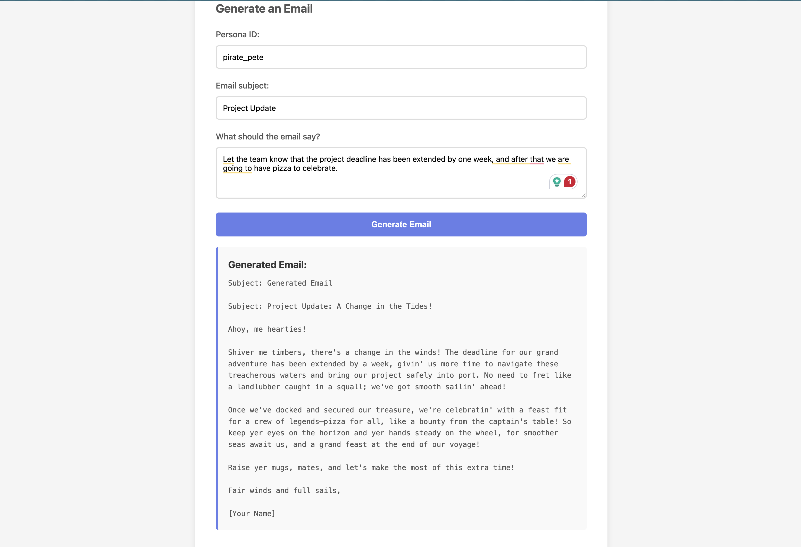

# StyleMail POC 📧

A powerful Proof of Concept for generating personalized, style-aware emails using OpenAI and Redis. This system learns individual writing styles and generates emails that match those styles using Retrieval-Augmented Generation (RAG).

## ✨ Features

- **Style Learning**: Analyzes writing samples to learn user-specific writing styles
- **RAG-Powered Generation**: Uses embeddings to retrieve relevant style examples
- **Multi-User Support**: Redis-backed storage for multiple user profiles
- **Nudge Integration**: Connects with Laudio API for employee nudge management
- **Docker Ready**: Complete containerization with Redis included
- **Multiple Interfaces**: FastAPI server, CLI, Python module, and web UI

## 🚀 Quick Start (Docker)

The easiest way to get started is using Docker:

1. **Clone the repository**:

   ```bash
   git clone <your-repo-url>
   cd LLM-POC-StyleMail
   ```

2. **Set up environment variables**:

   ```bash
   cp .env.example .env
   # Edit .env and add your OPENAI_API_KEY
   ```

3. **Start the services**:

   ```bash
   docker compose up -d
   ```

4. **Access the application**:

   - API: http://localhost:8000
   - API Docs: http://localhost:8000/docs
   - Web Demo: http://localhost:8000/static/demo.html

   

5. **Stop the services**:
   ```bash
   docker compose down
   ```

## 📦 Manual Installation

If you prefer to run without Docker:

1. **Install Redis** (if not already installed):

   ```bash
   # macOS
   brew install redis
   brew services start redis

   # Ubuntu/Debian
   sudo apt-get install redis-server
   sudo systemctl start redis
   ```

2. **Install Python dependencies**:

   ```bash
   pip install -r stylemail/requirements.txt
   ```

3. **Set up environment variables**:

   ```bash
   export OPENAI_API_KEY="your-key-here"
   export REDIS_HOST="localhost"
   export REDIS_PORT="6379"
   ```

4. **Run the server**:
   ```bash
   uvicorn server:app --reload
   ```

## 📖 Usage

### Web Interface

Visit http://localhost:8000/static/demo.html for an interactive demo.

### API Examples

#### 1. Seed User Writing Style

```bash
curl -X POST "http://localhost:8000/seed" \
  -H "Content-Type: application/json" \
  -d '{
    "user_id": "john_doe",
    "samples": [
      "Hey! Thanks for reaching out. I'\''ll get back to you shortly.",
      "Looking forward to our meeting tomorrow. See you then!",
      "Just wanted to follow up on our conversation from last week."
    ]
  }'
```

#### 2. Generate a Style-Aware Email

```bash
curl -X POST "http://localhost:8000/generate" \
  -H "Content-Type: application/json" \
  -d '{
    "user_id": "john_doe",
    "subject": "Project Update",
    "prompt": "Let the team know that the project deadline has been extended by one week"
  }'
```

#### 3. Generate Nudge Summary

```bash
curl -X POST "http://localhost:8000/nudge-summary" \
  -H "Content-Type: application/json" \
  -d '{
    "user_id": "manager_123",
    "prompt": "Summarize employee performance nudges",
    "email": "your-email@example.com",
    "password": "your-password",
    "employee_id": "emp_456"
  }'
```

### Python Module

```python
from stylemail import seed_user_style, generate_email

# Seed user style
seed_user_style("user123", [
    "Thanks for your message.",
    "Looking forward to our meeting."
])

# Generate email
email = generate_email(
    "user123",
    "Follow up",
    "Remind about the quarterly review meeting"
)
print(email["body"])
```

### CLI

```bash
# Seed user style
python -m stylemail.cli seed user123 "Sample 1" "Sample 2"

# Generate email
python -m stylemail.cli generate user123 "Follow up on the proposal"
```

## 🔌 API Endpoints

| Endpoint            | Method | Description                                |
| ------------------- | ------ | ------------------------------------------ |
| `/health`           | GET    | Health check endpoint                      |
| `/seed`             | POST   | Seed user writing style with samples       |
| `/generate`         | POST   | Generate a style-aware email               |
| `/fetch-nudge-data` | POST   | Fetch employee nudge data from Laudio      |
| `/nudge-email`      | POST   | Generate email based on nudges             |
| `/nudge-summary`    | POST   | Generate summary of employee nudges        |
| `/docs`             | GET    | Interactive API documentation (Swagger UI) |

## 🎯 Demo Data

To quickly populate the system with demo data:

```bash
python demo_seed.py
```

This will create several sample users with different writing styles.

## 🏗️ Architecture

```
┌─────────────┐      ┌──────────────┐      ┌─────────────┐
│   Client    │─────▶│  FastAPI     │─────▶│   OpenAI    │
│  (Web/CLI)  │◀─────│   Server     │◀─────│     API     │
└─────────────┘      └──────────────┘      └─────────────┘
                            │
                            ▼
                     ┌──────────────┐
                     │    Redis     │
                     │ (Embeddings) │
                     └──────────────┘
```

**Key Components:**

- **FastAPI Server**: REST API for all operations
- **Redis**: Vector storage for user writing style embeddings
- **OpenAI API**: Embedding generation and text completion
- **SQLite**: Nudge summary caching
- **Docker**: Complete containerization with hot reload

## 🛠️ Technology Stack

- **Backend**: Python 3.11, FastAPI, Uvicorn
- **AI/ML**: OpenAI GPT-4o, text-embedding-ada-002
- **Storage**: Redis (vector store), SQLite (caching)
- **Frontend**: Vanilla HTML/CSS/JavaScript
- **DevOps**: Docker, Docker Compose

## 📝 Environment Variables

| Variable         | Description               | Default                        |
| ---------------- | ------------------------- | ------------------------------ |
| `OPENAI_API_KEY` | OpenAI API key (required) | -                              |
| `REDIS_HOST`     | Redis server host         | `redis` (Docker) / `localhost` |
| `REDIS_PORT`     | Redis server port         | `6379`                         |
| `REDIS_DB`       | Redis database number     | `0`                            |
| `REDIS_PASSWORD` | Redis password (optional) | -                              |

## 🧪 Testing

```bash
# Run tests
pytest stylemail/tests/

# Test specific module
pytest stylemail/tests/test_api.py
```

## 📊 Use Cases

1. **Personal Email Assistant**: Learn individual writing styles and generate emails
2. **Team Communication**: Maintain consistent tone across team communications
3. **Manager Support**: Generate personalized nudge emails for team members
4. **Customer Service**: Generate responses in company voice

## 🤝 Contributing

1. Fork the repository
2. Create a feature branch
3. Make your changes
4. Submit a pull request

## 📄 License

MIT License - See LICENSE file for details

## 🙏 Acknowledgments

- OpenAI for GPT-4 and embedding models
- Redis for vector storage capabilities
- FastAPI for the excellent web framework
